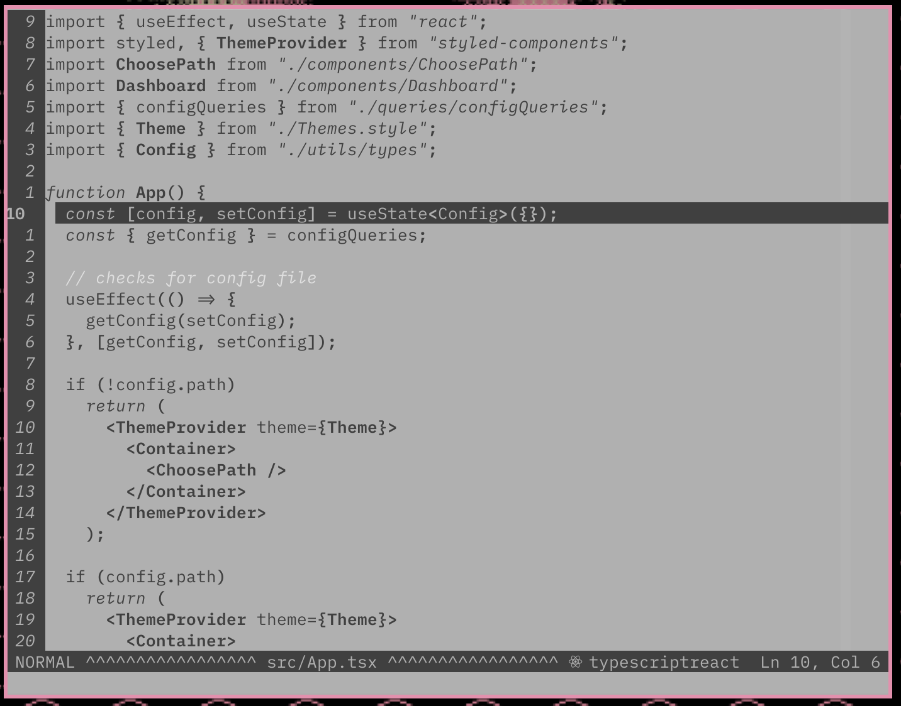
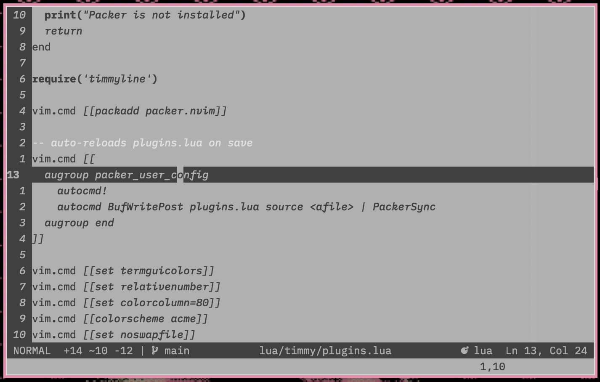

# visitant.vim

minimal greyscale theme for Vim.

### screenshots




### installation

with packer:

```
return require('packer').startup(function(use)

use { 'timmyha/visitant.vim' }

end)
```

### usage

`:colorscheme visitant`

### credits

forked from [acme-colors](https://github.com/plan9-for-vimspace/acme-colors)
